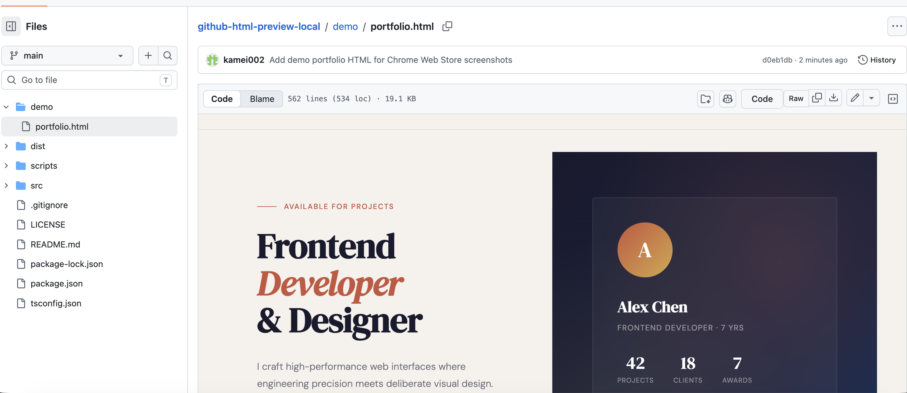

# GitHub HTML Preview Local


Preview HTML files directly inside GitHub's file view, without entering a GitHub access token.

GitHub HTML Preview Local adds a **Preview** button beside GitHub's Raw file controls. It reads the HTML source already visible on the current GitHub file page and renders it in the same file panel, including relative CSS and image assets when they are accessible through GitHub raw URLs.



## Highlights

- Preview `.html` and `.htm` files without leaving GitHub
- No GitHub access token, API call, or external preview server required
- Uses the source code already rendered in your browser
- Resolves relative CSS and image paths through GitHub raw file URLs
- Renders inside an extension-owned sandbox frame to avoid GitHub page CSP issues
- Includes English and Japanese extension messages
- Useful for public repositories and private repositories you can already view in GitHub

## How It Works

1. Open an HTML file on GitHub.
2. Click **Preview** beside GitHub's Raw file controls.
3. The extension captures the visible source from the file page.
4. The preview replaces the code panel in the current GitHub view.
5. Click **Code** to switch back to the original source view.

The extension does not call the GitHub API to read the current file. It only uses content already available in the page you are viewing.

## Install Locally

```sh
npm install
npm run build
```

Then load the built extension:

1. Open `chrome://extensions`.
2. Enable **Developer mode**.
3. Click **Load unpacked**.
4. Select the `dist` directory.

After source changes, run `npm run build` again and reload the extension from `chrome://extensions`.

## Development

```sh
npm run check
npm run build
npm run package
```

Project layout:

```text
src/extension/          Static extension files
src/extension/_locales/ Extension locale messages
src/scripts/            TypeScript source for content/background/sandbox scripts
src/types/              Minimal Chrome API type declarations
scripts/                Build helper scripts
dist/                   Built unpacked extension
release/                Generated Chrome Web Store ZIP package
docs/images/ss1.png     README screenshot
docs/images/icon.png    Chrome Web Store icon source
```

## Privacy

- No GitHub access token is required.
- Repository content is not uploaded to an external service.
- Preview rendering happens in your browser.
- The extension targets GitHub pages needed for previewing displayed HTML files.

## Limitations

- Relative assets must be accessible from the current browser session through GitHub raw URLs.
- Files not shown on the current GitHub page are not fetched through the GitHub API.
- JavaScript execution is disabled in the rendered preview sandbox.
- GitHub UI changes may require updates to the DOM integration.

## Intended Use

This extension is best for quick checks of simple HTML files, prototypes, documentation pages, and small static examples directly from GitHub.

It is not intended to replace a local development server or GitHub Pages deployment for complex websites.
